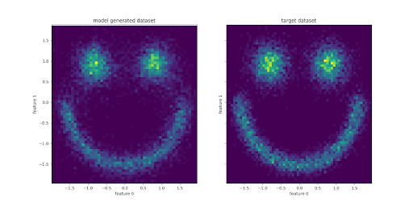

# Scaling Laws for Flow Matching

Scaling Laws for Flow Matching (SLFM) is a project for understanding scaling laws and how they affect flow matching models. 

### Scope
- [x] Flow matching on a toy dataset. 
- [x] Implement u-mup.  
- [ ] Coordinate check for unit activations during training. 
- [ ] Evaluate convergence by varying different aspects like lr, width, depth etc.  

## Installation

```
python -m venv venv 
source venv/bin/activate

pip install .
pip install -e .
pip install -e ".[dev]"
```

## Usage

### Config 

The config file can be found at: `slfm/cli/conf/base.yaml`

### Train and evaluate 

```
width=512
depth=5
train_and_evaluate  "++model.width=${width}" "++model.n_blocks=${depth}"
```

### Expected outcome 

## Thanks

The project starts from a very cool [notebook](https://bm371613.github.io/conditional-flow-matching/) on flow matching. A lot of the code for scaling is borrowed from this [guide](https://github.com/cloneofsimo/scaling-guide/).

